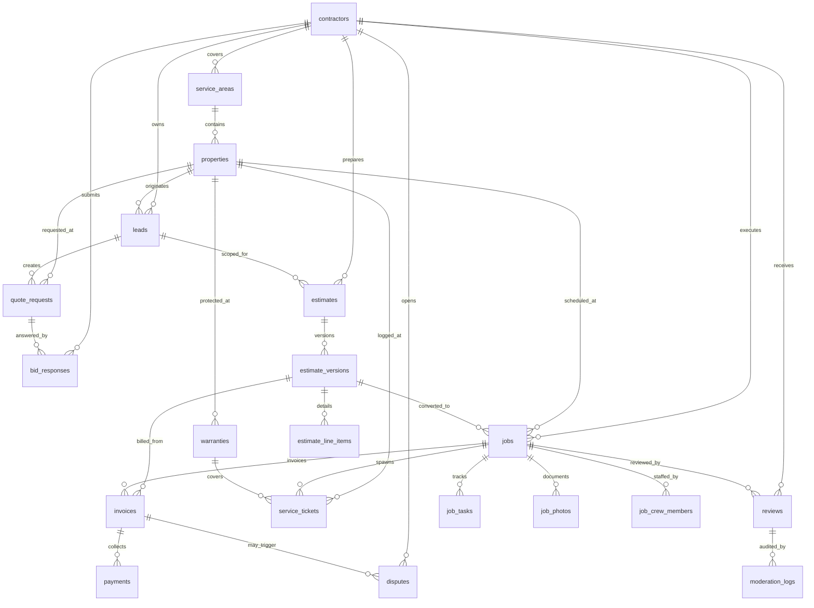

# Operational Pipeline ERD

This schema models the CRM + marketplace flow for lead capture through production, billing, and post-install service. It is Postgres/PostGIS-ready and aligns with Stripe for billing references.

## Table highlights
- **Geo search**: `properties.location` and `service_areas.geometry` use PostGIS with GiST indexes; `postal_codes` has a GIN index for prefix/array lookups.
- **Lead tagging**: `leads.tags` GIN index supports fast filtering for campaign- or service-based segmentation.
- **Versioned estimates**: `estimate_versions` enforce per-estimate uniqueness on version numbers. `accepted_version_id` links the estimate to the signed scope.
- **Stripe alignment**: `invoices.stripe_invoice_id` and `payments.stripe_payment_intent_id` store provider references and remain unique.
- **Compliance**: `contractors` keep license/insurance metadata; `service_areas` can be toggled active for marketplace eligibility.
- **Aftercare**: `warranties` connect to the completed job and property, enabling service tickets to reference warranty coverage.

## Suggested API usage
- **Lead intake**: create a `lead` with `property` geo data; attach `quote_requests` for scoping. Filter by `status` and `tags` using the provided indexes.
- **Marketplace bidding**: contractors respond via `bid_responses`; accepted quotes create `estimates` and initial `estimate_versions`.
- **Production**: when an estimate version is approved, spawn a `job`, `job_tasks`, and crew assignments. Use `job_photos` to surface progress in the homeowner app.
- **Billing**: issue an `invoice` referencing the signed `estimate_version`; Stripe IDs keep the external ledger linked. `payments` capture settlement status.
- **Quality + trust**: `reviews` capture homeowner feedback; `moderation_logs` and `disputes` provide governance and escalation tracking.

## Seeder alignment
The `db/seeds/seed_operational_pipeline.sql` file mirrors the ERD with a realistic Barrie/Orillia workflow: contractors, mapped service areas, qualified leads, a patio quote with materials and line items, scheduled job with tasks/photos, Stripe-referenced billing, warranty coverage, and downstream service/moderation records. Use it to validate API endpoints and UI flows end-to-end.
